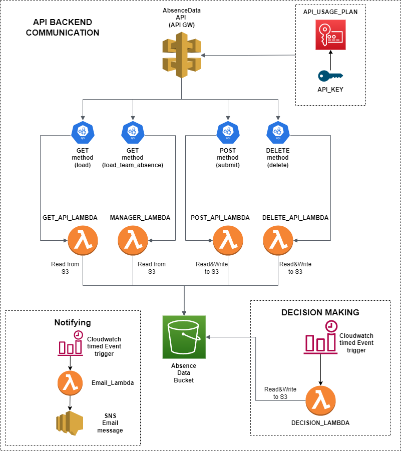

# Documentation 


## Architecture of the product




## Infrastructure

The infrastructure is deployed using Terraform. The terraform files used are: ```lambda.tf & api_gateway.tf```

## Description of the infrastructure

### Lambdas

<details closed>
<summary>GET Method Lambda</summary>
<br>
This lambda is responsible for the GET method of the api endpoint.
It has a dependency of a query parameter in the URL: personID
By catching the event of the requestor (fe. personID=3), it then returns all the information of the given persons absence data.
The code first checks if the bucket exists and after that check it checks if the function has the necessary permissions to access the bucket and its content.
Once these checks have successfuly passed it proceeds on parsing the event query and gets the necessary information from the S3 .json file.
</details>

<details closed>
<summary>Manager Lambda (Get method)</summary>
<br>
This lambda is responsible for the GET method of the manager api endpoint.
It has a dependency of a query parameter in the URL: managerID
By catching the event of the requestor (fe. managerID=3), it then returns all the information of the given managers team absence data.
The code first checks if the bucket exists and after that check it checks if the function has the necessary permissions to access the bucket and its content.
Once these checks have successfuly passed it proceeds on parsing the event query and gets the necessary information from the S3 .json file depending on the managerID.
</details>

<details closed>
<summary>DELETE Lambda (Delete method)</summary>
<br>
This lambda is responsible for the DELETE method of the api endpoint.
It has a dependency on the "id" parameter in the event body.
By catching the event of the id, it then proceeds to verify if the given requested absence date has been Approved or if it is still in Pending state.
The code first checks if the bucket exists and after that check it checks if the function has the necessary permissions to access the bucket and its content.
Once these checks have successfuly passed it proceeds on parsing the event query and gets the necessary information from the S3 .json file depending on the request ID.
The lambda function then returns the corresponding statusCode: 200 = Success, 405 = Operation not allowed, 404 = other type of error.
If the return value is 200, the deletion went on successfully.
</details>

<details closed>
<summary>POST Lambda (Delete method)</summary>
<br>
This lambda is responsible for the POST method of the api endpoint.
It has a dependency on the event body.
By catching the body, it creates a json dictionary of the requested absence by an employee.
The code first checks if the bucket exists and after that check it checks if the function has the necessary permissions to access the bucket and its content.
Once these checks have successfuly passed it proceeds on parsing the event query and checks if the person has a big enough leave balance, if he does, then it writes the requested absence into the DB.
The lambda function then returns the corresponding statusCode: 200.
</details>

## Absence_rating_system

### Data_Handler.py

<details closed>
<summary>DBHandler - constructor</summary>
<br>
This constructor initialize all tables from database and all rules for rating with rules order and rules thresholds. Input parameters are strings that are representing paths for every datatable.
</details>

<details closed>
<summary>__load_table</summary>
<br>
This function is loading AWS table by input parameter "path" (string - path to object). Second input parameter is "as_df" (bool) for decision if path is for datatable or json file. Output from this function is json object.
</details>

<details closed>
<summary>update_db</summary>
<br>
This function is responsible for updating AWS datables. Input paramameters are "db" (pandas dataframe) and "datapath" (string - path to pandas dataframe).
</details>

<details closed>
<summary>update_item</summary>
<br>
This function is responsible for updating column in pandas dataframe with given value. Input parameters "value" (any - inserted value), "row_idx" (int - index of row), string "column" (string - name of the column) and "table" (pandas dataframe - table which is being updated).
</details>

<details closed>
<summary>__rules_preprocessing</summary>
<br>
This function is responsible for droping unused rules for specific customer. Input parameter is "rules" (pandas dataframe - table with rules).
</details>

<details closed>
<summary>get_requests</summary>
<br>
This function return all absence data with given status. Input parameter is "status" (string - status of request).
</details>

<details closed>
<summary>get_request_by_id</summary>
<br>
This function return request record by its id. Input parameter is "request_id" (int - id of request).
</details>

<details closed>
<summary>get_ouid_of_request</summary>
<br>
This function return ID of OU of given request. Input parameter is "request" (pandas series).
</details>

<details closed>
<summary>get_min_same_job_threshold</summary>
<br>
This function return required minimum of present people with same job as request job. Input parameter is "request" (pandas series - information about team).
</details>

<details closed>
<summary>get_employee_info</summary>
<br>
This function return informations about employee by request. If parameter "info" is not None function return only specified information about employee. Input parameters are "request" (pandas series - employee information) and "info" (string - specified column for decision) 
</details>

<details closed>
<summary>get_ou_employees</summary>
<br>
This function return all employees in OU of given request. If parameter "only_id" is True function return only specified employees ID in OU of given request. Input parameters are "request"(pandas series - ou employees) and "only_id" (int - number of specified employee for decision). 
</details>

<details closed>
<summary>get_size_of_ou</summary>
<br>
This function return size of OU of given request. Input parameters is "request" (pandas series - organization unit). 
</details>

<details closed>
<summary>get_ou_absence_data</summary>
<br>
This function return OU absence data in which request employee is in. If parameter "status_of_absence" is not All function return only specified status absence. Input parameters are "request" (pandas series - organization unit) and "status_of_absence" (string - absence status for decision). 
</details>

<details closed>
<summary>get_ou_same_job_employees</summary>
<br>
This function return employees with same job as request job. If parameter "only_id" is True function return only id of this employees. Input parameters are "request" (pandas series - organization unit) and "only_id" (bool - condition for decision). 
</details>

<details closed>
<summary>get_ou_same_job_absence</summary>
<br>
This function return absence data of OU only of the same job as request job. Input parameter is "request" (pandas series - organization unit).
</details>

<details closed>
<summary>format_absence_dates</summary>
<br>
This function return formated specified columns by format in data. Input parameters are "data" (pandas dataframe - returned columms), "columns" (list - representing values AbsenceFrom and AbsenceTo (AbsenceFrom, AbsenceTo)) and "format" (time format - specified time format for parameter "columns").
</details>

<details closed>
<summary>get_absence_type_priority</summary>
<br>
This function return absence type priority of specified request. Input parameter is "request" (pandas series - representing rules priority).
</details>

<details closed>
<summary>get_request_leave_hours</summary>
<br>
This function return total leave hours of requested absence. This function multiples the sum up days between "absence_from" and "absence_to" by "working_hours". Weekend days are not counting. Input parameter are "request" (pandas series - representing AbsenceFrom and AbsenceTo) and "working_hours" (int - number which represent working hours).
</details>

<details closed>
<summary>check_enough_leave_balance</summary>
<br>
This function return True if request has enough leave balance left. Input parameter is "request" (pandas series - represent employee).
</details>

<details closed>
<summary>set_ou_rating_duration</summary>
<br>
This function set duration of rating and changing statuses of pending ou requests. Input parameters are "ouid" (string - represent oraginazation unit) and "start_time" (time - start time of the duration)
</details>

<details closed>
<summary>get_rules_by_keys</summary>
<br>
This function return rule keys and corresponding functios to call as list of DICTs.
</details>

<details closed>
<summary>get_rules_with_order</summary>
<br>
This function return tuple (rules keys in priority order, sort order booleans).
</details>

<details closed>
<summary>get_rule_threshold_by_key</summary>
<br>
This function return threshold for specified rule by key. Input parameter is "rule_key" (string - represent rule)
</details>

<details closed>
<summary>get_rule_status_failed_resolution</summary>
<br>
This function return resolution of rule for specified failed rule by key. Input parameter is "rule_key" (string - represent rule)
</details>

<details closed>
<summary>get_overlapping_days</summary>
<br>
This function compute set of overlapping days between given ranges (range2 - range1). After computing the set of overlapping days are returned. Input parameters are "range1" and "range2" (list of Timestamps - [absence_from, absence_to]).
</details>


### ARS.py

<details closed>
<summary>rule_overlapping_employees_no</summary>
<br>
This function computes number of overlapping employees in same team as request is with already accepted timeoffs with dates of given requests. After computing, the number of overlapping days are returned (int). Input parameter is request to check overlapping days with - pandas.Series.
</details>

<details closed>
<summary>rule_min_capacity_threshold</summary>
<br>
This function computes if minimal capacity of team is not under specified threshold. 
If there are less team members in team than specified threshold 1 is returned, otherwise 0 is returned. Input parameter is request - pandas.Series.
</details>

<details closed>
<summary>rule_same_job_overlaps</summary>
<br>
This function computes number of overlapping employees in same team with same job as request with already accepted timeoffs with dates of given requests. After computing, the number of overlapping days are returned (int). Input parameter is request to check overlapping days with - pandas.Series.
</details>

<details closed>
<summary>rule_min_same_job_threshold</summary>
<br>
This function computes if there are enough team members with same job in same team.
If there are less team members with same job in team than specified threshold 1 is returned, otherwise 0 is returned. Input parameter is request - pandas.Series.
</details>

<details closed>
<summary>rule_set_absence_type_priority</summary>
<br>
This function returns absence type priority of given request as int. Priority is specified in absence_type.json. 
</details>

<details closed>
<summary>rule_leave_balance</summary>
<br>
This function returns request leave balance. If request if TIMEOFF and has enough leave balance, than actual leave balance is returned, otherwise 0 is returned to trigger leave balance rule. If request is not TIMEOFF than 1 is returned to not trigger leave balance rule. Input parameter is request - pandas.Series.
</details>

<details closed>
<summary>rating_function</summary>
<br>
This function rates all pending requests in OU of specified request based on rules specified in rules priority. The end results of rating one request is saved in dictionary with keys same as used rules in rating. Afterwards, in absence data attribute "Rating" is updated to resulting dictionary. Process is repeated for every pending OU requests. Input parameter is request - pandas.Series.
</details>

<details closed>
<summary>get_top_priority_request</summary>
<br>
This function returns tuple of top priority request from all OU pending requests and one dataframe row of that top priority request. First it gets all pending OU requests that have been rated. Takes only rating attribute and create pandas.DataFrame from it. Afterwards, the dataframe is sorted by specified sorting priorities and keys. Input parameter is request - pandas.Series.
</details>

<details closed>
<summary>determine_top_priority_status</summary>
<br>
This function determines request status if "Accepted" or "Rejected" by checking if any thesholds were triggered. If triggered, status "Rejected" is set to request with resolution why it failed, otherwise "Accepted" is set. Input parameter is request - pandas.Series.
</details>

<details closed>
<summary>set_ou_requests_statuses</summary>
<br>
This function sets statuses to all OU pending requests. First it rates all OU pending requests, then get top priority status based on rating, then status is set. If request is "Rejected" and its "TIM" then leave balance is added to actual leave balance. Algorithm begins from the start. Input parameter is request - pandas.Series.
</details>

<details closed>
<summary>absence_requests_handler</summary>
<br>
This function handle all pending requests until there is none left. First it takes all pending requests in absence_data dataframe. Then it passes first request to function "set_ou_requests_statuses". 
</details>

<details closed>
<summary>Using class</summary>
<br>

```py
path_absence_table = "back-end/src/data/jsons/absence_data.json" #path to absence data table 
path_teams_table = "back-end/src/data/jsons/teams_table.json" #path to teams data table 
path_employees_table = "back-end/src/data/jsons/employees_table.json" #path to employees data table 
path_jobs_table = "back-end/src/data/jsons/jobs_table.json" #path to jobs data table 
path_absence_type_table = "back-end/src/data/jsons/absence_type.json" #path to absence type data table 
path_rules_table = "back-end/src/data/jsons/rules_table.json" #path to rules data table 

# creating object
ars = ARS(path_absence_table, path_teams_table, path_employees_table, path_jobs_table, path_absence_type_table, path_rules_table)

# run algorithm 
ars.absence_requests_handler()
```
</details>

### Data tables

<details closed>
<summary>absence_data.json</summary>
<br>
Absence_data.json consists of list of dictionaries, where one dictionary is one record of absence.

*Structure*
```json
{
    "id": int,
    "EmployeeID": int,
    "AbsenceRequestedAt": Timestamp,
    "AbsenceFrom": "dd/mm/YYYY",
    "AbsenceTo": "dd/mm/YYYY",
    "AbsenceTypeCode": "code acronym in 3 letters - TIM, SPE, PAR",
    "Status": "status of request - Pending, Accepted, Rejected, Cancelled",
    "StatusResolution": "OK / Resolution fail from rules",
    "OverlappingDays": [Timestamp, Timestamp, ...],
    "LeaveReason": "optional request description",
    "Rating": {
        "key": int,
        "key": int,
        "key": int
    }
}
```

*Content example*
```json
{
    "id": 12,
    "EmployeeID": 62,
    "AbsenceRequestedAt": 1641582819.008814,
    "AbsenceFrom": "19/01/2022",
    "AbsenceTo": "21/01/2022",
    "AbsenceTypeCode": "SPE",
    "Status": "Pending",
    "StatusResolution": "OK",
    "OverlappingDays": [],
    "LeaveReason": "test8",
    "Rating": {
        "A": 0,
        "B": 0,
        "C": 1,
        "D": 1
    }
}
```
</details>

<details closed>
<summary>absence_type.json</summary>
<br>
Absence_type.json consists of list of dictionaries, where one dictionary is one record of type of absence.

*Structure*
```json
{
    "AbsenceID": int,
    "AbsenceName": "name",
    "AbsenceAcronym": "3 letters acronym - TIM, SPE, PAR",
    "AbsenceInfo": "info about absence",
    "Priority": int
}
```

*Content example*
```json
{
    "AbsenceID": 0,
    "AbsenceName": "Special",
    "AbsenceAcronym": "SPE",
    "AbsenceInfo": "Funeral, sick kid...",
    "Priority": 1
}
```
</details>


<details closed>
<summary>employees_table.json</summary>
<br>
Employees_table.json consists of list of dictionaries, where one dictionary is one record of employee in company.

*Structure*
```json
{
    "EmployeeID": int,
    "EmployeeName": "FirstName LastName",
    "EmploymentNumber": int,
    "OUID": int,
    "LeaveBalance": int,
    "LeaveBalanceDisplay": int
}
```

*Content example*
```json
{
    "EmployeeID": 69,
    "EmployeeName": "paul bleacher",
    "EmploymentNumber": 1,
    "OUID": 7,
    "LeaveBalance": 160,
    "LeaveBalanceDisplay": 160
}
```
</details>


<details closed>
<summary>jobs_table.json</summary>
<br>
Jobs_table.json consists of list of dictionaries, where one dictionary is one record of job type in company.

*Structure*
```json
{
    "id": int,
    "JobName": "Job name",
    "MinRequirement": int
}
```

*Content example*
```json
{
    "id": 2,
    "JobName": "Support",
    "MinRequirement": 1
}
```
</details>


<details closed>
<summary>rules_table.json</summary>
<br>
Rules_table.json consists of list of dictionaries, where one dictionary is one record of rule used in ARS system.

*Structure*
```json
{
    "key" : "key of ruke",
    "function": "name of ARS method to use as rule",
    "sortAscending": boolean (how to sort requests by this rule),
    "threshold": int or null not to use this rule in sorting algorithm,
    "priority": int,
    "testByThisRule": boolean,
    "resolutionFailed": "Explanation why resolution failed"
}
```

*Content example*
```json
{
    "key" : "A",
    "function": "rule_min_capacity_threshold",
    "sortAscending": false,
    "threshold": 1,
    "priority": 3,
    "testByThisRule": true,
    "resolutionFailed": "Not enough employees in team"
}
```
</details>


<details closed>
<summary>teams_table.json</summary>
<br>
Teams_table.json consists of list of dictionaries, where one dictionary is one record of organization unit in company.

*Structure*
```json
{
    "OUID": int,
    "ManagerID": int,
    "MinimalCapacity": int,
    "TeamName": "Team name",
    "LastChangeMS": Timestamp,
    "RatingDurationMS": millis time of rating duration
}
```

*Content example*
```json
{
    "OUID": 8,
    "ManagerID": 7,
    "MinimalCapacity": 3,
    "TeamName": "MLC",
    "LastChangeMS": 1639310498.8898501,
    "RatingDurationMS": 91.6020870209
}
```
</details>

## Terraform code

In this section the resource blocks present in the .tf files will be explained.

```js
resource "aws_lambda_function" "local_name_of_resource" {
  function_name = "name_of_function_on_cloud"  //here the developer defines the name of the function

  s3_bucket = "bucket_name"  //name of the bucket where the source code (in zipped format) is located
  s3_key    = "zip_file_name" //path to the .zip file

  handler = "main.lambda_handler" //file executor (main.py)
  runtime = "python3.8" //runtime (python, node etc..)

  role = "${aws_iam_role.lambda_exec.arn}" //define the role which the lambda function will be using
  layers = ["arn:aws:lambda:eu-central-1:770693421928:layer:Klayers-python38-pandas:43", "arn:aws:lambda:eu-central-1:770693421928:layer:Klayers-python38-numpy:22"] //import necessary layers for code execution
   environment {
    variables = {
      BUCKET_NAME = "s3_bucket_name" //define env. variables
      OBJECT_NAME_TEAMS = "db_file_name"
    }
  }
}


resource "aws_sns_topic" "local_sns_topic_name" { //create sns topic
  name = "name_of_sns_topic" //define name for sns topic on the cloud
}

resource "aws_sns_topic_subscription" "local_name_for_subscription" { //create subscription to sns topic
  topic_arn = aws_sns_topic.manager_updates.arn // depends on the topic above
  protocol  = "email" //message protocol (email, email-json, push notif, sms etc..)
  endpoint  = "value_here" // endpoint address (phone number, webhook url, email address etc.)
}


resource "aws_cloudwatch_event_rule" "local_name_for_cw_event_rule" {
    name = "value_here" //define name for cw event rule
    description = "Launches every day at 18:01" // description of the event rule
    schedule_expression = "cron(01 18 * * ? *)" //cron job expression in cw format
}

resource "aws_cloudwatch_event_target" "local_name_for_cw_event_target" {
    rule = "${aws_cloudwatch_event_rule.every_day_mail.name}"//depends on the event rule specified above
    target_id = "MAILING_LAMBDA" // target id 
    arn = "${aws_lambda_function.mailing_lambda.arn}" //arn of the targeted lambda
}

resource "aws_lambda_permission" "local_name_for_lambda_permission" {
    statement_id = "AllowExecutionFromCloudWatch" //statement from where it will execute
    action = "lambda:InvokeFunction" // what we want it to do(action)
    function_name = "${aws_lambda_function.mailing_lambda.function_name}" //link to dependent arn of lambda
    principal = "events.amazonaws.com" // what service launches the process 
    source_arn = "${aws_cloudwatch_event_rule.every_day_mail.arn}" //source arn for the cw event rule
}


resource "aws_api_gateway_resource" "local_name_for_api_resource" {
  rest_api_id = "${aws_api_gateway_rest_api.example.id}" //dependend on the api id
  parent_id   = "${aws_api_gateway_rest_api.example.root_resource_id}" //dependent on the root resource of the api 
  path_part   = "submit" // URL path
}


resource "aws_api_gateway_method_response" "local_method_response_name" {
  rest_api_id = aws_api_gateway_rest_api.example.id //dependend on the api id
  resource_id = aws_api_gateway_resource.post.id //dependent on the resource of the api (in this case post, which is above)
  http_method = aws_api_gateway_method.post.http_method // dependent on the method of the api (in this case post)
  status_code = 200

  /**
   * This is where the configuration for CORS enabling starts.
   * We need to enable those response parameters and in the 
   * integration response we will map those to actual values
   */
  response_parameters = {
    "method.response.header.Access-Control-Allow-Headers"     = true,
    "method.response.header.Access-Control-Allow-Methods"     = true,
    "method.response.header.Access-Control-Allow-Origin"      = true,
    "method.response.header.Access-Control-Allow-Credentials" = true
  }
}

resource "aws_lambda_permission" "local_name_for_lambda_perms" {
  statement_id  = "AllowAPIGatewayInvoke_POST" //what we want it to invoke
  action        = "lambda:InvokeFunction" //what action
  function_name = "${aws_lambda_function.post_lambda.function_name}" //what function it is for
  principal     = "apigateway.amazonaws.com" // service responsible for the action

  
  source_arn = "${aws_api_gateway_rest_api.example.execution_arn}/*/*"
}


resource "aws_api_gateway_rest_api" "local_name_for_api_gw_api" {
  name        = "Absence_Data_API" // name of the api in the cloud interface
  description = "First stage of API" // description of the api
}

resource "aws_api_gateway_integration" "local_name_for_apigw_integration" {
  rest_api_id = "${aws_api_gateway_rest_api.example.id}" //depends on rest api id above
  resource_id = "${aws_api_gateway_method.post.resource_id}" // depends  on api resource id of post
  http_method = "${aws_api_gateway_method.post.http_method}"// depends  on api method id of post

  integration_http_method = "POST" //integration method
  type                    = "AWS_PROXY" // type of api integration
  uri                     = "${aws_lambda_function.post_lambda.invoke_arn}" //invoke uri of lambda function
}

resource "aws_api_gateway_integration_response" "lambda_lambda_api_gw_integration_response_name" {
  rest_api_id = aws_api_gateway_rest_api.example.id //depends on rest api id above
  resource_id = aws_api_gateway_resource.post.id // depends  on api resource id of post
  http_method = aws_api_gateway_method.post.http_method // depends  on api method id of post
  status_code = aws_api_gateway_method_response.post_api_response.status_code // depends on api method response code

  /**
   * This is second half of the CORS configuration.
   * Here we give values to each of the header parameters to ALLOW 
   * Cross-Origin requests from ALL hosts.
   **/
  response_parameters = {
    "method.response.header.Access-Control-Allow-Headers"     = "'Content-Type,X-Amz-Date,Authorization,X-Api-Key,X-Amz-Security-Token'",
    "method.response.header.Access-Control-Allow-Methods"     = "'GET,OPTIONS,POST,PUT'",
    "method.response.header.Access-Control-Allow-Origin"      = "'*'",
    "method.response.header.Access-Control-Allow-Credentials" = "'true'"
  }

  response_templates = {
    "application/json" = <<EOF
{
  "statusCode": 200,
  "message": "OK! Everything in order"
}
EOF
  }
}


resource "aws_api_gateway_deployment" "local_deployment_of_api_name" {
  //the deployment of the api depends on the resources in this list (this block makes sure they are created before this resource block gets executed)  
  depends_on = [
    "aws_api_gateway_integration.lambda", 
    "aws_api_gateway_method_response.post_api_response",
    "aws_api_gateway_method_response.get_api_response",
    "aws_api_gateway_method_response.get_ou_api_response",
    "aws_api_gateway_method_response.delete_api_response"
  ]

  rest_api_id = "${aws_api_gateway_rest_api.example.id}" //which api to deploy
}

resource "aws_api_gateway_stage" "local_name_for_stage_resource" {
  deployment_id = aws_api_gateway_deployment.example.id //references deployment id above
  rest_api_id   = aws_api_gateway_rest_api.example.id // references api id above
  stage_name    = "value_here" // definition of stage name
}

//creation of api key
resource "aws_api_gateway_api_key" "local_api_key_resource_name" {
  name = "value_here" //name of the api key 
}

resource "aws_api_gateway_usage_plan" "local_api_plan_resource_name" {
  name         = "value_here" // name of api plan to be deployed
  description  = "usage plan for product" // description of api plan
  product_code = "01" // code of api plan

  //which stages will use this api plan  
  api_stages {
    api_id = aws_api_gateway_rest_api.example.id
    stage  = aws_api_gateway_stage.development.stage_name
  }
  //quota settings for the number of calls for the api endpoints
  quota_settings {
    limit  = 20
    offset = 2
    period = "WEEK"
  }
  //throttle settings
  throttle_settings {
    burst_limit = 5
    rate_limit  = 10
  }
}

//assigning the above created api_key to the usage_plan
resource "aws_api_gateway_usage_plan_key" "main" {
  key_id        = aws_api_gateway_api_key.API_Key.id //depends on the api key id
  key_type      = "API_KEY" // key type (in our case API KEY)
  usage_plan_id = aws_api_gateway_usage_plan.api-plan.id // depends on the usage_plan id
}

//calling cors module to enable cors for the given api methods (has to be called multiple times, does not support entry of resource id from list)
module "cors" {
  source  = "squidfunk/api-gateway-enable-cors/aws"
  version = "0.3.3"

  api_id            = aws_api_gateway_rest_api.example.id
  api_resource_id   = aws_api_gateway_resource.get.id
  allow_credentials = true
}

```

## Tests

The tool for testing is called **Coverage**. Main testing functions are **Assert Equal, Assert Array Equal, Assert Frame Equal and Assert Series Equal.**

### ARS test

In ARS test the main goal is to test the overall functionality of the code. It's using test cases as a main approach to test every possible scenario, which may occur. Every test case is testing if the dataframe returned by main ARS file is same as expected dataframe.

1. Test case is testing 2 employees with requested timeoff at the different days. 
2. Test case is testing 2 employees with requested timeoff at the same days. 
3. Test case is testing 2 employees with one requesting timeoff and second requesting parental holiday at the same day. 
4. Test case is testing 2 employees with both of them requesting parental holiday at the different days. 
5. Test case is testing 2 employees with one of them requesting parental holiday and second one requesting special holiday at the different days. 
6. Test case is testing 2 employees with requested timeoff at the same 5 days. 
7. Test case is testing 2 employees with requested timeoff with overlapping days, one employee is requesting 3 days and the other 5 days.


### Data Handler test

Data Handler test is testing every function in original file Data Handler. Every function is testing if output from the function in Data handler is same as expected output. Both expected output and output from the function must be equal, otherwise test returns error.
